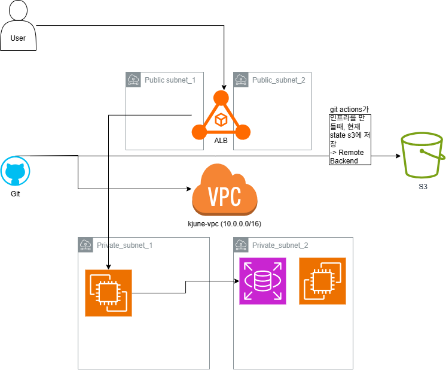

# Cloud-AI-Infra: AWS & IaC Automation Project
"Terraform과 Docker를 활용한 고가용성 AWS 3-Tier 인프라 및 CI/CD 파이프라인 구축"

1. 프로젝트 개요
목적: 수동 인프라 구축의 한계를 극복하기 위해 **IaC(Terraform)**를 도입하고, 애플리케이션의 컨테이너화(Docker) 및 자동 배포(GitHub Actions) 환경을 구현함.

핵심 성과: 1분 20초 이내에 전체 인프라 리소스 배포 및 애플리케이션 업데이트 완료.

2. 시스템 아키텍처

3. 주요 구현 특징
Infrastructure as Code (IaC): Terraform을 사용하여 VPC, Subnet, ALB, EC2, RDS, S3(Remote Backend)를 코드로 관리.

고가용성(High Availability): Multi-AZ 설계를 통해 가용 영역 장애에 대비한 안정적인 서비스 환경 구축.

보안 및 망 분리: Public/Private 서브넷을 엄격히 분리하여 데이터베이스(RDS)를 외부 위협으로부터 보호.

CI/CD 파이프라인: GitHub Actions를 통해 Docker 이미지를 빌드하고 AWS ECR에 자동 푸시하는 배포 자동화 구현.

4. 사용 기술 (Tech Stack)
Cloud: AWS (VPC, EC2, ALB, RDS, S3, ECR)

Automation/IaC: Terraform, GitHub Actions

Container: Docker, FastAPI (Python)

-------------------------------------------------------
2026-03-01 ~ 03-02 추가 업데이트
-------------------------------------------------------

1단계: 아키텍처 설계 (3-Tier Infrastructure)
가장 먼저 구축한 것은 보안이 강화된 표준 기업용 아키텍처였습니다.

Public Layer: **ALB(Application Load Balancer)**가 외부 트래픽을 수용합니다.

Private Layer: EC2 인스턴스들이 외부 노출 없이 안전하게 숨어 있습니다.

Data Layer: **RDS(MySQL)**가 프라이빗 환경에서 EC2와 통신합니다.

🔒 2단계: 프라이빗 접속의 비밀 (VPC Endpoints & STS)
프라이빗 서브넷에 있는 EC2에 SSH 키 없이 접속하기 위해 **SSM(Systems Manager)**을 사용했습니다. 이를 위해 인터넷 없이 AWS 서비스와 대화하는 '전용 통로'를 뚫었습니다.

VPC Interface Endpoints: ssm, ec2messages, ssmmessages 3총사를 생성.

STS Endpoint: 마지막 퍼즐 조각. 인스턴스가 자신의 IAM Role(신분증)을 AWS 본사에 확인받기 위해 필요한 통로입니다.

보안 그룹 자가 허용(Self-reference): 보안 그룹 설정에서 HTTPS(443) 포트의 Source를 자기 자신의 보안 그룹 ID로 설정해야 인스턴스가 엔드포인트 대문을 열고 대화할 수 있습니다.

🌐 3단계: 인터넷 통로와 패키지 관리 (NAT Gateway)
SSM 접속은 성공했지만, 인스턴스 안에서 도커나 파이썬을 깔려고 하니 인터넷이 안 되는 문제가 발생했습니다.

NAT Gateway: 퍼블릭 서브넷에 설치하여 프라이빗 EC2가 밖으로 나가는 것만 허용했습니다.

Route Table: 프라이빗 라우팅 테이블에 0.0.0.0/0 -> NAT Gateway ID 규칙을 추가하여 인스턴스에게 외출 경로를 알려줬습니다.

AL2023 & DNF: 사용 중인 Amazon Linux 2023에서는 기존의 yum 대신 차세대 패키지 관리자인 **dnf**를 사용하는 것이 표준임을 확인했습니다.

🚀 4단계: 애플리케이션 자동 배포 (User Data)
인스턴스가 생성될 때 자동으로 앱을 실행하기 위해 userdata.sh를 완성했습니다.

핵심 코드 흐름
Nginx 설정: 80번 포트로 들어온 요청을 파이썬 앱이 떠 있는 8000번 포트로 전달(Reverse Proxy).

FastAPI 앱 생성: test_main.py를 작성하고 RDS 연결 테스트 코드를 삽입.

가상환경(Venv): python3 -m venv로 독립적인 환경을 구축하고 fastapi, uvicorn, pymysql 설치.

백그라운드 실행: nohup과 &를 사용하여 터미널을 꺼도 앱이 유지되도록 설정.

⚠️ 5단계: 운영 및 보안 (Git & Destroy)
마지막으로 배포 성공을 확인하고 뒷정리를 진행했습니다.

502 Bad Gateway 해결: 앱이 뜨기까지의 시간차를 기다리거나, user-data.log를 통해 Network is unreachable 에러(라우팅 문제)를 진단하고 해결했습니다.

Git Push: 성공한 코드를 저장했지만, userdata.sh에 DB 비밀번호가 하드코딩된 채로 올라간 점을 인지했습니다. (추후 Secrets Manager 등으로 개선 필요)

Terraform Destroy: 비용 절감을 위해 NAT Gateway, ALB, RDS 등 모든 자원을 깔끔하게 삭제했습니다.
