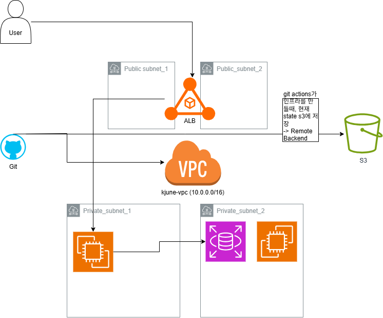

# Cloud-AI-Infra: AWS & IaC Automation Project
"Terraform과 Docker를 활용한 고가용성 AWS 3-Tier 인프라 및 CI/CD 파이프라인 구축"

1. 프로젝트 개요
목적: 수동 인프라 구축의 한계를 극복하기 위해 **IaC(Terraform)**를 도입하고, 애플리케이션의 컨테이너화(Docker) 및 자동 배포(GitHub Actions) 환경을 구현함.

핵심 성과: 1분 20초 이내에 전체 인프라 리소스 배포 및 애플리케이션 업데이트 완료.

2. 시스템 아키텍처

3. 주요 구현 특징
Infrastructure as Code (IaC): Terraform을 사용하여 VPC, Subnet, ALB, EC2, RDS, S3(Remote Backend)를 코드로 관리.

고가용성(High Availability): Multi-AZ 설계를 통해 가용 영역 장애에 대비한 안정적인 서비스 환경 구축.

보안 및 망 분리: Public/Private 서브넷을 엄격히 분리하여 데이터베이스(RDS)를 외부 위협으로부터 보호.

CI/CD 파이프라인: GitHub Actions를 통해 Docker 이미지를 빌드하고 AWS ECR에 자동 푸시하는 배포 자동화 구현.

4. 사용 기술 (Tech Stack)
Cloud: AWS (VPC, EC2, ALB, RDS, S3, ECR)

Automation/IaC: Terraform, GitHub Actions

Container: Docker, FastAPI (Python)

-------------------------------------------------------
2026-03-01 ~ 03-02 추가 업데이트
-------------------------------------------------------

1단계: 아키텍처 설계 (3-Tier Infrastructure)
가장 먼저 구축한 것은 보안이 강화된 표준 기업용 아키텍처였습니다.

Public Layer: **ALB(Application Load Balancer)**가 외부 트래픽을 수용합니다.

Private Layer: EC2 인스턴스들이 외부 노출 없이 안전하게 숨어 있습니다.

Data Layer: **RDS(MySQL)**가 프라이빗 환경에서 EC2와 통신합니다.

🔒 2단계: 프라이빗 접속의 비밀 (VPC Endpoints & STS)
프라이빗 서브넷에 있는 EC2에 SSH 키 없이 접속하기 위해 **SSM(Systems Manager)**을 사용했습니다. 이를 위해 인터넷 없이 AWS 서비스와 대화하는 '전용 통로'를 뚫었습니다.

VPC Interface Endpoints: ssm, ec2messages, ssmmessages 3총사를 생성.

STS Endpoint: 마지막 퍼즐 조각. 인스턴스가 자신의 IAM Role(신분증)을 AWS 본사에 확인받기 위해 필요한 통로입니다.

보안 그룹 자가 허용(Self-reference): 보안 그룹 설정에서 HTTPS(443) 포트의 Source를 자기 자신의 보안 그룹 ID로 설정해야 인스턴스가 엔드포인트 대문을 열고 대화할 수 있습니다.

🌐 3단계: 인터넷 통로와 패키지 관리 (NAT Gateway)
SSM 접속은 성공했지만, 인스턴스 안에서 도커나 파이썬을 깔려고 하니 인터넷이 안 되는 문제가 발생했습니다.

NAT Gateway: 퍼블릭 서브넷에 설치하여 프라이빗 EC2가 밖으로 나가는 것만 허용했습니다.

Route Table: 프라이빗 라우팅 테이블에 0.0.0.0/0 -> NAT Gateway ID 규칙을 추가하여 인스턴스에게 외출 경로를 알려줬습니다.

AL2023 & DNF: 사용 중인 Amazon Linux 2023에서는 기존의 yum 대신 차세대 패키지 관리자인 **dnf**를 사용하는 것이 표준임을 확인했습니다.

🚀 4단계: 애플리케이션 자동 배포 (User Data)
인스턴스가 생성될 때 자동으로 앱을 실행하기 위해 userdata.sh를 완성했습니다.

핵심 코드 흐름
Nginx 설정: 80번 포트로 들어온 요청을 파이썬 앱이 떠 있는 8000번 포트로 전달(Reverse Proxy).

FastAPI 앱 생성: test_main.py를 작성하고 RDS 연결 테스트 코드를 삽입.

가상환경(Venv): python3 -m venv로 독립적인 환경을 구축하고 fastapi, uvicorn, pymysql 설치.

백그라운드 실행: nohup과 &를 사용하여 터미널을 꺼도 앱이 유지되도록 설정.

⚠️ 5단계: 운영 및 보안 (Git & Destroy)
마지막으로 배포 성공을 확인하고 뒷정리를 진행했습니다.

502 Bad Gateway 해결: 앱이 뜨기까지의 시간차를 기다리거나, user-data.log를 통해 Network is unreachable 에러(라우팅 문제)를 진단하고 해결했습니다.

Git Push: 성공한 코드를 저장했지만, userdata.sh에 DB 비밀번호가 하드코딩된 채로 올라간 점을 인지했습니다. (추후 Secrets Manager 등으로 개선 필요)

Terraform Destroy: 비용 절감을 위해 NAT Gateway, ALB, RDS 등 모든 자원을 깔끔하게 삭제

--------------------------------------------
2026-03-03
--------------------------------------------

🚀 Architecture & Features (아키텍처 및 주요 기능)

3-Tier 아키텍처 기반 자동화 배포: ALB - ASG(EC2, Amazon Linux 2023) - RDS(MySQL) 구조를 Terraform으로 코드로 관리(IaC)하여 일관된 인프라 프로비저닝 환경 구축.

보안 및 비용 최적화: 퍼블릭망(SSH, 22번 포트) 접근을 전면 차단하고, NAT Gateway 대신 VPC Endpoint(AWS PrivateLink)를 연동하여 AWS Systems Manager(SSM)를 통한 안전한 프라이빗 원격 접속 구현 및 트래픽 비용 절감.

동적 구성 관리: Terraform의 templatefile을 활용해 RDS 엔드포인트 등의 동적 변수를 EC2의 userdata.sh에 주입하여 하드코딩 방지 및 보안성 강화.

🛠 Troubleshooting & Optimization (문제 해결 및 최적화)

이슈: EC2 프로비저닝 완료 후 ALB DNS 접속 시 Nginx 502 Bad Gateway 에러 발생.

원인 파악: 인프라 네트워크(보안 그룹, 라우팅) 문제가 아님을 인지하고, SSM을 통해 프라이빗 EC2에 직접 접속. /var/log/user-data.log 및 애플리케이션 백그라운드 실행 로그(app.log)를 분석하여 Python 스크립트 내 DB 연결부의 구문/들여쓰기 에러가 원인임을 특정.

해결 및 IaC 동기화: 1. EC2 내부에서 라이브 핫픽스(Hotfix)를 적용하여 DB 연결 및 애플리케이션 정상 동작(방문자 카운터 API) 1차 확인.
2. 수동으로 수정한 코드를 Terraform userdata.sh에 역으로 동기화(Sync)하고 GitHub Actions를 통해 재배포.
3. 코드 수정 시 기존 인프라와 상태가 어긋나는 Drift 현상을 방지하기 위해, 불변 인프라(Immutable Infrastructure) 원칙에 따라 ASG 인스턴스를 교체(terraform apply -replace)하여 무결성 확보.

-- 추가로 sudo date -s "$(wget -qSO- --max-redirect=0 google.com 2>&1 | grep Date: | cut -d' ' -f5-8)Z" 
-> 테라폼 destroy중 로컬터미널과 실제 인터넷시간이 틀려서 destroy 과정중 에러가났음 위는 해결법

----------------------------------
2026-03-04
----------------------------------

# 1. 이전에 앞서 만들어놨던 ollama를 활용한 ai모듈과 내가만든 테라폼 인프라에 얹혀보기

1. 우선 내가 만든 테라폼 rds는 mysql을 기반으로 되어있기에 cloud-ai-infra에 맞게 PostgreSQL로 변형
--> PostgreSQL을 쓰는 이유: 복잡한 쿼리 처리능력좋고, AI관련 메타데이터나 JSON형식을 다루는 데 강함

2. modules/rds/main.tf 수정
기존 mysql설정을 PostgreSQL 환경에 맞춰 업데이트

3. userdata_ollama.sh 수정

4. 기존 dev워크스페이스 상 t2.micro를 ollama구동에 맞게 t3.large로 업그레이드

5. 기존 instance_type 선언 수정

6. 기존 userdata템플릿코드부분 이름 userdata_ollama.sh로 수정

7. postgreSQL 버전에러발생
aws rds describe-db-engine-versions \
    --engine postgres \
    --query "DBEngineVersions[?starts_with(EngineVersion, '16')].EngineVersion" \
    --output table
해당명령어로 최신 버전 찾고 해결

8. http://test-alb-dev-518069650.ap-northeast-2.elb.amazonaws.com/ask?prompt=안녕 내이름은 이경준이야 | 입력

9. 현재 llama파일 받는것 시간때문에 에러가남 -> 바로 ssm 로그확인

10. 로그확인의 2가지 명령어
# 1. 유저데이터 실행 로그 확인 (모델 다운로드 상태 확인 가능)
cat /var/log/user-data-ollama.log

# 2. FastAPI 애플리케이션 로그 확인 (파이썬 에러 확인)
cat /home/ec2-user/app/app.log

11. ollama 대답확인중 시간초과발생

-> 트러블슈팅해결사례
CPU 기반 AI 추론 서버 구축 중, 모델 연산 시간(약 47초)이 로드밸런서의 기본 임계값(60초)에 근접하여 504 Gateway Timeout이 발생하는 것을 확인했습니다. ALB의 Idle Timeout 설정을 300초로 최적화하여 서비스 가용성을 확보했으며, 서버 로그 분석을 통해 비정상 종료와 타임아웃의 차이를 명확히 구분하여 대응하였음

그리고 postgreSQL에 접속해서 내가 보내는 질문에 대답이 들어왔는지 확인
<EC2 내부에서 PostgreSQL 접속 (비밀번호 입력 필요)>
psql -h ${db_endpoint} -U test -d test_PostgreSQL

<대화기록회>
SELECT * FROM ai_history;

12. terrform destroy

-------------------------
2026-03-06
-------------------------

1. 문제발생 및 배경

문제상황: t3.large환경에서 Llama3 모델을 서빙할 때, Locust 부하 테스트 결과 성공률이 0퍼센트, 504 에러 발생

원인분석: 단일 추론 시간이 300초를 초과해서 ALB및 Nginx의 타임아웃 임계치를 넘어섰으며, 사양 대비 모델이너무 무거워 발생한걸로 생각

2. 결정

모델 교체: Llama3 모델 대신 가벼운 TinyLlama로 모델을 교체하기로함

최적화: 무조건적인 인스턴스 스펙상향보다는, 비용측면에서 효율적이고 프로젝트상 결과도출이 시급한 지금, 현재 하드웨어에  최적화된 모델을 선택하는 경험을 해봄

3. 결과

성능 : 동일한 t3.large환경에서 실패율이 0% 달성
-> 10명이 접속하는 시뮬레이션 환경은 동일했음

가용성 확보: 인프라의 전구간의 가동 안정성을 확보했음. 이제 사용자에게 지연없는 대화 제공가능.

다음단계-> Terraform을 활용해 Cloudwatch로 모니터링 환경 구축예정

<CloudWatch 및 SNS로 실시간 통보채널 확보>
1.우선 dlrudalswns2@gmail.com으로 구독을하여 일정 cpu사용량 초과시 알람이 오도록 설정

2.ssm연결해서 현재 서버에 stress-ng --cpu 2 --timeout 600s 로 부하를 줬음

3. 몇 분있어 바로 이메일로 알람(경고)가 왔음

4. 콘솔창에 CloudWatch로 들어가보니 CPU의 부하가 초과하는걸 직접 표로 볼수있었음

5. 그리고 stress를 중단했더니, 곧바로 CPU의 부하가 정상적으로 줄어들었음을 발견

결론: 이로써 CloudWatch를 통해 모니터링으로 장애를 확인할수있음을 경험했음.

